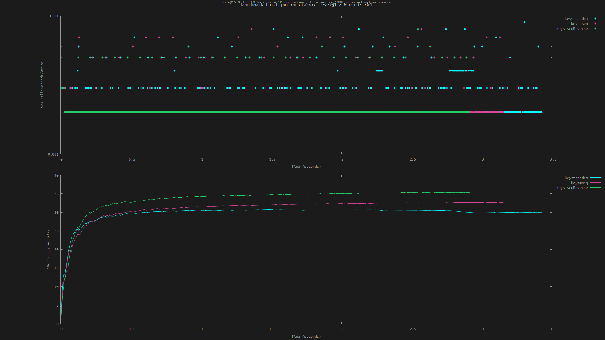

# level-bench

**Benchmark [`abstract-level`](https://github.com/Level/abstract-level) databases.** Currently only suitable for use in Node.js.

[![level badge][level-badge]](https://github.com/Level/awesome)
[](https://www.npmjs.com/package/level-bench)
[](https://www.npmjs.com/package/level-bench)
[](https://github.com/Level/bench/actions/workflows/test.yml)
[](https://codecov.io/gh/Level/bench)
[](https://standardjs.com)
[](https://common-changelog.org)
[](https://opencollective.com/level)

## Example

```
npm i level-bench classic-level
npx level-bench run batch-put classic-level -c ClassicLevel
npx level-bench run batch-put classic-level -c ClassicLevel --b [ --keys seq ]
npx level-bench run batch-put classic-level -c ClassicLevel --b [ --keys seqReverse ]
npx level-bench plot batch-put
```

Yields the following (showing that writing keys in reverse sequential order is fastest):



## Highlights

- Target the current working directory or something npm-installed
- Compare benchmarks of different targets or options
- Derives plot labels from benchmark metadata (package, platform, ..)
- Uses unique temporary directories for every db
- Also takes `ioredis` and `sqlite3` (see [`third-party/`](./third-party)).

## Usage

### `level-bench run <benchmark> [target]`

Run a benchmark. The `benchmark` argument must be one of the named benchmarks listed below.

The `target` argument should be a path or an npm package name that is installed nearby (for example `level-bench run put classic-level -c ClassicLevel`). It defaults to the current working directory. A `package.json` must exist alongside the resolved `target`. If the module doesn't have a default export, pass a `--class` or `-c` option to use a named export by that name.

If `target` does not create persistent databases (like `memory-level`) you must pass `--mem`.

Options for the db can be provided via `--db <subargs>`. For example `--db [ --cacheSize 16mb ]` or `--db [ --valueEncoding json ]`. Note that the brackets must be surrounded by spaces.

Benchmark-specific options can be provided via `-b <subargs>`. For example `-b [ -n 1e6 --concurrency 1 ]`. These options are listed below.

Results are by default written to `.benchmarks/<benchmark>.<time>.csv` and an accompanying JSON file for metadata. To write results to a custom file specify `--out example.csv` (`-o` for short). The metadata is used to derive a distinct benchmark name. When this doesn't suffice (for example because you're benchmarking a spinning disk versus an SSD, a fact that isn't included in the metadata) or when labels in the plot become too long, you can specify a custom name with `--name example`.

#### Examples

We can compare the performance of two git branches:

```
git checkout main && npm i
level-bench run put -c Level

git checkout wip && npm i
level-bench run put -c Level
```

Or check the overhead of a specific encoding:

```
level-bench run put level -c Level --db [ --valueEncoding utf8 ]
level-bench run put level -c Level --db [ --valueEncoding json ]
```

Or compare the effect of options:

```
level-bench run put classic-level -c ClassicLevel
level-bench run put classic-level -c ClassicLevel --db [ --no-compression ]
```

Then plot both (or more) runs with:

```
level-bench plot put
```

#### Options

Yet to document.

### `level-bench plot <benchmark> [files]`

Plot the results using `gnuplot` (which must be installed and available in `PATH`). The `files` argument should be ([glob patterns](https://github.com/mrmlnc/fast-glob) resolving to) CSV files as generated by `level-bench run`. If not provided, defaults to `.benchmarks/<benchmark>.*.csv`.

The plot is written to `.benchmarks/<benchmark>.<time>.png` by default. This can be overridden with `--out <filename>` (`-o` for short).

#### Options

Yet to document.

## Benchmarks

### `put`

Perform concurrent `put()` operations. Records the Simple Moving Average (SMA) of the duration of the last 1000 writes, as well as the Cumulative Moving Average (CMA) of the throughput in MB/s. Options:

- `-n`: amount of operations, default 1e6
- `--concurrency`: default 4
- `--keys` (string): one of:
  - `random` (default): generate pseudo-random numeric keys (0-N) with a certain probability `distribution`
  - `seq`: non-random, sequential numeric keys (0-N)
  - `seqReverse`: same keys but in reverse (N-0)
- `--values` (string): one of:
  - `random` (default): generate pseudo-random values
  - `empty`: zero-length values or zero-filled if `valueSize` is set
- `--seed` (string): seed to use for random numbers, defaults to `'seed'`
- `--distribution` (string): one of [`zipfian`](https://github.com/vweevers/zipfian-integer), `uniform` (default)
- `--skew` (floating-point number): Zipfian skew (default 0)
- `--offset` (number): offset keys (for example to simulate timestamps)
- `--valueSize`: size of value, as a number in bytes or string with unit (e.g. `--valueSize 1kb`)
- `--keyAsBuffer`, `--valueAsBuffer` (boolean): if not set, keys and values are written as strings (hex encoded).

Tips:

- To benchmark writing sorted data, use `--keys seq` or `seqReverse`
- Be mindful of `--concurrency` when using `--keys seq` or `seqReverse`: a high concurrency can counter the performance benefits of writing keys sequentially
- To use the `zipfian` distribution with a negative skew, specify it as `--skew=-1` rather than `--skew -1` (which would be interpreted as a flag).

### `batch-put`

Perform concurrent `batch()` operations. Same as `put`, but in batches rather than singular puts. Options:

- `--batchSize`: default 1000, must be a multiple of 10, maximum 1000
- `--chained`: boolean flag, default false, use chained batch
- `--concurrency`: default 1
- Other options are the same as of the `put` benchmark, see above.

### `get`

Perform `get()` operations. Inserts `-n` sequential keys into the database, then reads them (in random order by default). Records the Simple Moving Average (SMA) of the duration of the last 1000 reads, as well as the Cumulative Moving Average (CMA) of the throughput in MB/s. Options:

- `-n`: amount of operations, default 1e6
- `--get`: specify options for `get()` using subargs, for example `--get [ --no-fillCache ]`.
- `--concurrency`: default 1
- `--keys` (string): one of:
  - `random` (default): read pseudo-random numeric keys (0-N) with a certain probability `distribution`
  - `seq`: read non-random, sequential numeric keys (0-N)
  - `seqReverse`: same keys but in reverse (N-0)
- `--values` (string): one of:
  - `random` (default): write pseudo-random values
  - `empty`: write zero-length values or zero-filled if `valueSize` is set
- `--seed` (string): seed to use for random numbers, defaults to `'seed'`
- `--distribution` (string): one of [`zipfian`](https://github.com/vweevers/zipfian-integer), `uniform` (default)
- `--skew` (floating-point number): Zipfian skew (default 0)
- `--offset` (number): offset keys (for example to simulate timestamps)
- `--valueSize`: size of value, as a number in bytes or string with unit (e.g. `--valueSize 1kb`).
- `--valueEncoding`: valueEncoding option for `get()`. Defaults to none which means the default of the db will be used.

### `iterate`

Yet to document.

### `stream`

Yet to document.

### `self-distribution`

_Not a benchmark, but a temporary cheat to reuse the tooling we have here to test (and visualize) some of the internals. Needs a valid `target` argument, same as real benchmarks, although that argument is not actually used._

Generate keys with a certain order and probability distribution. Options:

- `-n`: amount of keys to generate, default 5e3
- Other options are passed to [`keyspace`](https://github.com/vweevers/keyspace)

Example:

```
level-bench run self-distribution memory-level -c MemoryLevel -b [ --distribution zipfian --skew 1 ]
level-bench run self-distribution memory-level -c MemoryLevel -b [ --distribution zipfian --skew=-1 ]
level-bench run self-distribution memory-level -c MemoryLevel -b [ --keys seq ]
level-bench plot self-distribution
```

<!-- ### Other ideas

- Write batches in different sizes (feature: define a matrix)
- Write while increasing the number of open iterators (and thus snapshots) -->

## Limitations

The target `abstract-level` implementation must take a `location` as its first argument (if persistent) or ignore that argument (if transient). Options are passed to both the constructor with the signature `(location, options)` and to `db.open(options, callback)`.

## Contributing

[`Level/bench`](https://github.com/Level/bench) is an **OPEN Open Source Project**. This means that:

> Individuals making significant and valuable contributions are given commit-access to the project to contribute as they see fit. This project is more like an open wiki than a standard guarded open source project.

See the [Contribution Guide](https://github.com/Level/community/blob/master/CONTRIBUTING.md) for more details.

## Donate

Support us with a monthly donation on [Open Collective](https://opencollective.com/level) and help us continue our work.

## License

[MIT](LICENSE)

[level-badge]: https://leveljs.org/img/badge.svg
