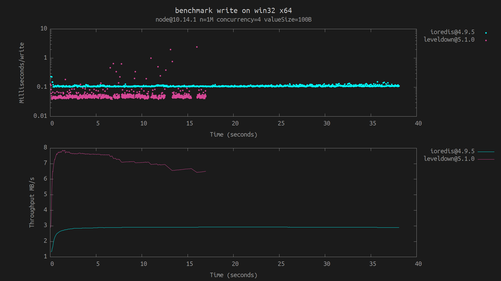
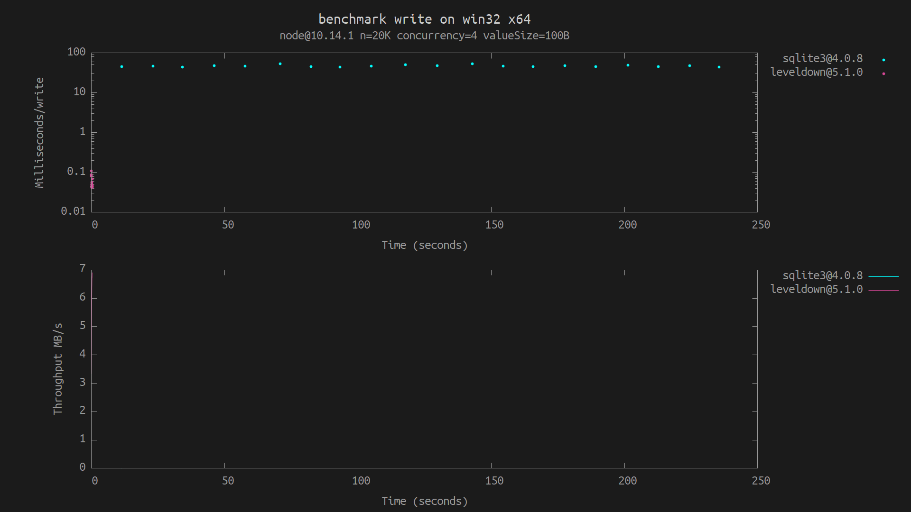

# Third party

This directory contains thin wrappers (that intentionally _don't_ implement the full `abstract-leveldown` interface) around third-party databases and libraries like [`ioredis`](https://github.com/luin/ioredis) and [`sqlite3`](https://github.com/mapbox/node-sqlite3), to be able to run `level-bench` on them for comparison.

## Supported benchmarks (so far)

The `write` benchmark on `ioredis` (`redis-server` must be available in `PATH`):

```
npm i ioredis leveldown
level-bench run write ioredis
level-bench run write leveldown
level-bench plot write
```



The `write` benchmark on `sqlite3` (100-1000x slower than `leveldown`, lower the amount of operations with `-n`):

```
npm i sqlite3 leveldown
level-bench run write sqlite3 -b [-n 2e4]
level-bench run write leveldown -b [-n 2e4]
level-bench plot write
```


